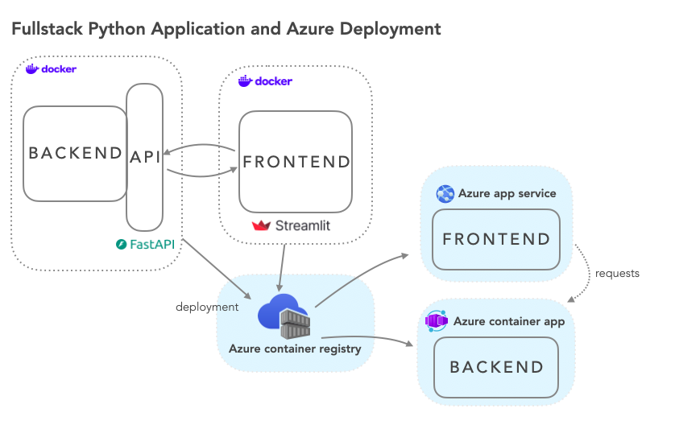

# eClipseBord - FastlyDep

## About

On August 12th 2026, a solar eclipse crossed parts of the world. **eClipseBord** is a dashboard built to explore and visualize data related to this event — from local exploratory analysis, through containerization, to a live cloud deployment on Azure.

The project is built around the **FastlyDep** stack: **Fast**API + **Streamlit** + **Dep**loy.

## Architecture

_Picture from Kokchun Giang_

**Two apps locally in seperate Docker containers**

- **Backend** (FastAPI)
- **Frontend** (Streamlit)

The frontend sends requests to the backend and gets data back

The Azure infrastructure (Container Registry, App Service, Container App) is provisioned using Terraform (azurerm provider).

To deploy, you push both Docker images to Azure Container Registry, which acts as a storage hub for your container images in the cloud.

From there, Azure pulls the images and runs them as live services:

- **Frontend** → Azure App Service
- **Backend** → Azure Container App

## Dataset

The dataset used contains data related to the August 12th 2026 solar eclipse. Source: _(https://www.kaggle.com/datasets/nasa/solar-eclipses?select=solar.csv)_

## EDA

A short exploratory data analysis was done in [`eda.ipynb`](eda.ipynb) using **Jupyter** and **Pandas**, to get a basic understanding of the dataset before building the dashboard. The focus of this project is cloud infrastructure, so the EDA is intentionally kept brief.

## Documentation

[Streamlit Documentation](https://docs.streamlit.io/)

[Terraform Documentation](https://registry.terraform.io/providers/hashicorp/azurerm/latest/docs)

[FastAPI Documentation](https://fastapi.tiangolo.com/)
